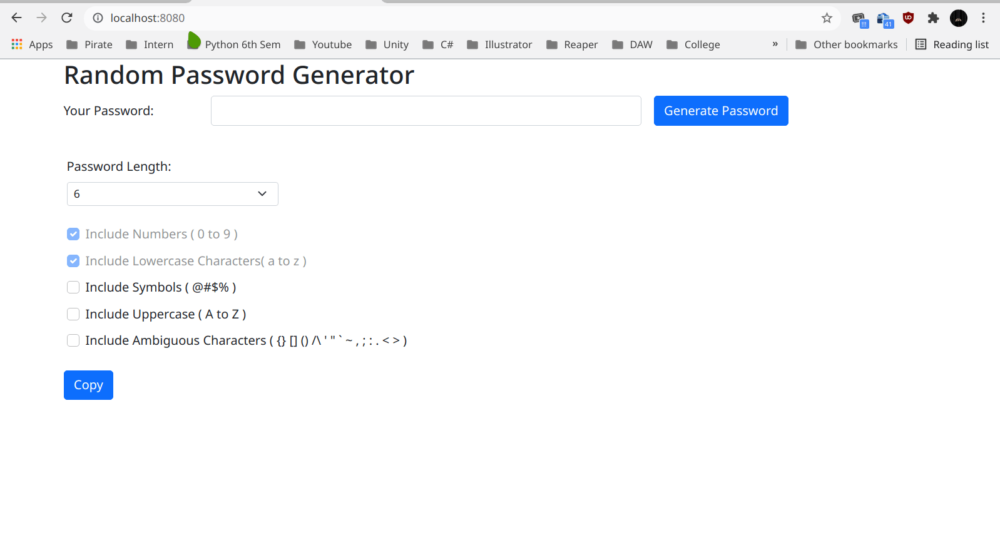
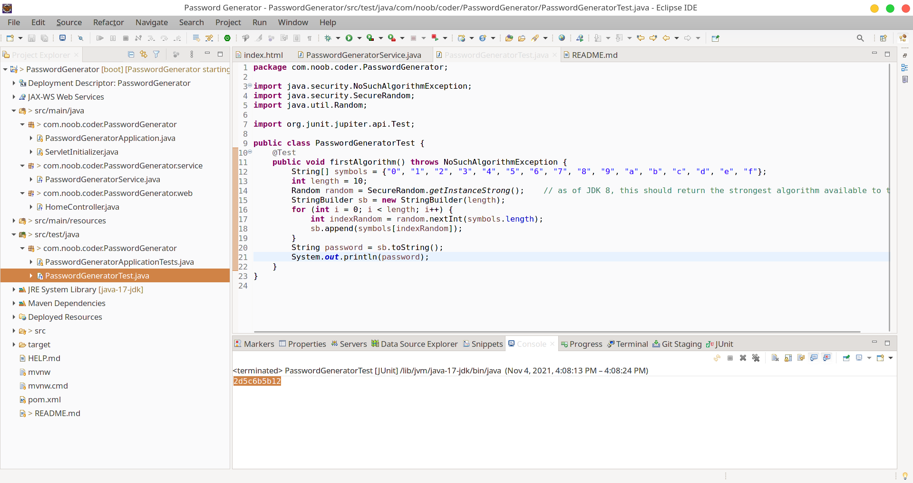

# Random Password Generator Web Application

## Demo

A password generator web application with some customization options to generate different type of passwords using Spring Boot, Hibernate,Maven.

## What is Random Password Generator

A random password generator is software program or hardware device that takes input from a random or pseudo-random number generator and automatically generates a password. Random passwords can be generated manually, using simple sources of randomness such as dice or coins, or they can be generated using a computer.

[Source Link](https://en.wikipedia.org/wiki/Random_password_generator#Java)

## Unit Testing the Password Generator Algorithm

